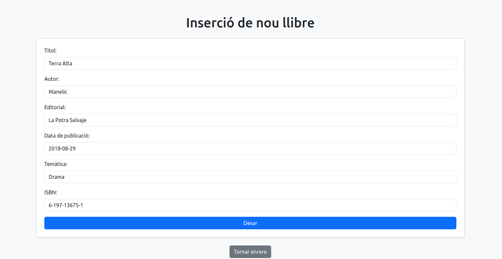
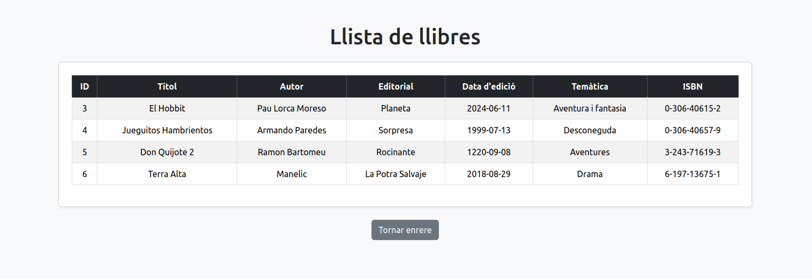
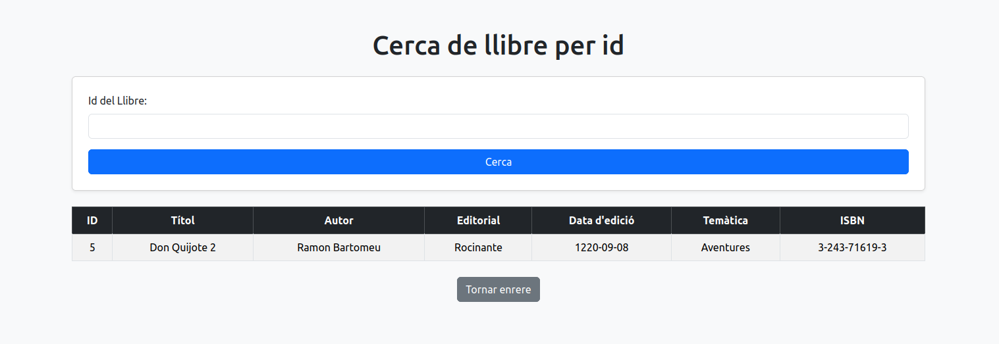

# M06-UF4-Activitat2

## Extres afegits
- Bootstrap: s'ha donat estil bàsic amb bootstrap. Principalment amb l'ús de contenidors i classes, però en cap cas modificant la llògica de l'aplicació
- S'ha afegit el control d'errors per a cadenes de text no numèriques al endpoint de cerca per ID. S'ha afegit un catch extra que captura _NunberFormatException_

## Prova de l'aplicació
### 1. Login
En arrancar l'aplicació i entrar, arribarem a la pàgina de login. Aquí introduirem les credencials de la imatge i premerem el botó **Accedir**.


### 2. Menú principal
Si introduim les credencials correctament, arribarem a la pàgina inicial. Si fallen les credencials, serem redirigits a la pàgina de login de nou.


### 3. Inserir nous llibres
A la pantalla per inserir un nou llibre podrem omplir el formulari per afegir nous llibres.



### 4. Consultar tots els llibres
Amb la opció del menú corresponent, podrem veure tots els llibres registrats:



### 5. Cerca per id
Podem buscar un llibre en concret pel seu ID




## Preguntes teòriques

### Per què al servei estem utilitzant mètodes que no hem declarat explícitament al repositori? Com és possible?
El nostre servei (_BookService.java_), utilitza els mètodes del nostre repositori (_RepoLlibre.java_). Aquest últim extén la classe CrudRepository, la qual ja ens dona els principals mètodes per a comunicar-nos amb la base de dades.

Pel que fa al servei, pot cridar l'atenció que al controlador sembla que instanciem la interficie _BookService_, però què passa realment? Amb la anotació **@Autowired**, injectarem el servei al controlador:

```java
private final BookService bookService;

@Autowired
public BookController(BookService bookService) {
    this.bookService = bookService;
}
```
Amb aquest codi, Spring s'encarrega de buscar la classe que implementa la interfície _BookService_, i donar-nos-en una instància directament.

### El repositori pot elegir fer l’extends de les interfícies PagingAndSortingRepository o de JpaRepository. En què es diferencien aquestes dues amb la interfície CrudRepository?
- **CrudRepository**: És la més bàsica de les 3. Porta els mètodes bàsics per a un CRUD. Amb un count(), i opcions de SELECT i DELETE per ID i indiscriminades.
- **PagingAndSortingRepository**: És una extensió de _CrudRepository_ que afegeix funcions per a treballar amb paginació i ordenació de resultats buscats.
- **JpaRepository**: Extensió de _PagingAndSortingRepository_ (i per tant de _CrudRepository_). Afegeix funcionalitats per a treballar amb entitats de tipus JPA.  

### Què significa Optional<Classe> i per a què serveix?
És un tipus de dades de Java que s'utilitza per representar un valor que pot estar present o absent. És una manera de gestionar els valors nuls (null) de forma més segura i expressiva, evitant errors com NullPointerException.

### Per què el controlador utilitza el servei i no la seva implementació?
L'objectiu d'utilitzar el servei amb injecció (Explicat breument a la pregunta 1), és la de fer que el controlador no depengui directament d'una implementació concreta. Com hem explicat abans, injectant el servei, Spring ens proveirà automàticament una instància de la classe que compleixi amb la interfície. En altres paraules, **estem fent que el controlador depengui d'una interfície enlloc d'una classe**. Això és clau per a que la nostra aplicació sigui flexible davant els canvis, permetent una gran escalabilitat.
